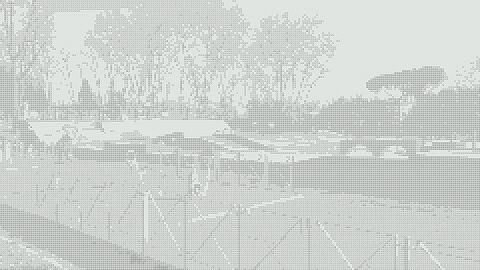

# Siss

A command-line tool for applying duotone and halftone effects to video and
still-image files. Duotone maps per-pixel luminance to a linear blend between
two user-supplied RGB colors; halftone renders plus, asterisk, slash, or dot
symbols at luminance-proportional sizes over a 3×3-pixel sampled grid, on a
square or hex-offset screen. Accepts hex strings, CSS named colors, RGB triples,
and named two-color palettes.


[](https://doi.org/10.5281/zenodo.21961222)
[](https://pepy.tech/projects/siss)




## Features

- **Duotone** – maps per-pixel luminance to a linear gradient between two RGB colors; `color1` is applied to dark areas, `color2` to light areas
- **Halftone** – renders plus, asterisk, slash, dot, or ring symbols at sizes proportional to local luminance (3×3-pixel sampled average), with independent symbol and background colors, over a square or hex-offset sampling grid, and an optional luminance-curve gamma for non-linear size mapping
- **Color input** – accepts 3- and 6-digit hex strings (with or without `#`), case-insensitive CSS named colors, RGB integer triples, and named two-color palettes via `--palette`
- **Codec selection** – probes `cv2.VideoWriter_fourcc` candidates per output format and OS at runtime; falls back through a priority list until a working codec is found
- **Audio passthrough** – after rendering, merges the original audio track into the output with `ffmpeg` (no video re-encode); disable with `--no-audio`
- **Output formats** – writes MP4, MOV, AVI, MKV, and WMV videos, plus PNG, JPEG, BMP, TIFF, and WebP still images; the format is inferred from the output file extension
- **Frame previews** – extract one frame from a video with `--preview-frame middle` or a numeric index and save it with `--preview-output` for fast iteration without waiting for a full render
- **Frame extraction** – save a single frame from a video as a still image with `--extract-frame`, without applying any effect
- **Custom palettes** – load your own two-color looks from a JSON file with `--palette-file`; custom names shadow built-in ones

## Installation

### Install from PyPI

```bash
pip install siss
```

### Clone for Development

1. Clone this repository:

   ```bash
   git clone https://github.com/MichailSemoglou/siss.git
   cd siss
   ```

2. Create a virtual environment (recommended):

   ```bash
   python -m venv venv
   source venv/bin/activate  # On Windows: venv\Scripts\activate
   ```

3. Install the required dependencies:

   ```bash
   pip install -r requirements.txt
   ```

4. Install the package so the `siss` command is available:
   ```bash
   pip install .
   # or, for an editable install that picks up source changes:
   pip install -e .
   ```

## Usage

### Basic Usage

```bash
siss input_video.mp4 output_video.mp4 --effect duotone
```

For a source checkout without installing:

```bash
PYTHONPATH=src python3 -m siss.main input_video.mp4 output_video.mp4 --effect duotone
```

The output format is determined by the file extension of the output path. Supported video containers: MP4, MOV, AVI, MKV, WMV. Supported still-image formats: PNG, JPEG, BMP, TIFF, WebP.

### Specifying Colors

Siss accepts colors in any of these forms:

| Form                                         | Example                                   |
| -------------------------------------------- | ----------------------------------------- |
| Hex string (with/without `#`, 3- or 6-digit) | `--color1 "#ff0044"` or `--color1 ff0044` |
| CSS named color                              | `--color1 rebeccapurple`                  |
| RGB triple (original syntax)                 | `--color1 255 0 0`                        |

> **Shell note:** quote hex values that start with `#` to prevent your shell from treating the character as a comment: `"#ff0044"`.

You can also select a complete two-color look with `--palette`:

```bash
siss input_video.mp4 output_duotone.mp4 --effect duotone --palette sunset
```

Browse the built-in palettes:

```bash
siss --list-palettes
```

Individual `--color1` and `--color2` flags override single slots of a selected palette. Precedence: explicit flag > constraints file > palette > default.

### Duotone Effect

```bash
siss input_video.mp4 output_duotone.mp4 --effect duotone --color1 255 0 0 --color2 0 255 255
```

Applies a duotone effect with red mapped to dark areas and cyan to light areas.

Using a hex color and a CSS name:

```bash
siss input_video.mp4 output_duotone.mp4 --effect duotone --color1 "#3b1f4b" --color2 gold
```

Using a palette:

```bash
siss input_video.mp4 output_duotone.mp4 --effect duotone --palette cyberpunk
```

### Halftone Effect

```bash
siss input_video.mp4 output_halftone.mp4 --effect halftone --symbol_size 12 --symbol_type asterisk --color1 0 0 0 --color2 255 255 255
```

Applies a halftone effect with black asterisks on a white background.

For the classic print-halftone look, use `dot` symbols on a `hex` grid, which staggers alternating rows by half a step to produce the interlocking dot screen of traditional print reproduction:

```bash
siss input_video.mp4 output_halftone.mp4 --effect halftone --symbol_type dot --grid_type hex --color1 0 0 0 --color2 255 255 255
```

### Still Images

This mode accepts still-image input and output paths only; it does not extract a frame from a video file:

```bash
siss input.jpg output.png --effect duotone --palette sunset
```

The input and output formats do not need to match; `siss` reads and writes through OpenCV's `cv2.imread`/`cv2.imwrite` for image paths.

### Codec Compatibility

Codec selection for video output is **automatic** — the tool probes available `cv2.VideoWriter_fourcc` candidates at runtime based on your OS and output container, falling back through a priority list until a working codec is found. No extra flags are needed.

### Available Options

- `--effect` – `duotone` or `halftone`; required for rendering commands, not used with `--extract-frame`
- `--color1` – first color: hex `#ff0044`, CSS name `rebeccapurple`, or RGB `255 0 0`. Default: red. Dark areas in duotone, symbols in halftone.
- `--color2` – second color, same accepted forms. Default: cyan. Light areas in duotone, background in halftone.
- `--palette` – named two-color palette (overrides the defaults; `--color1` and `--color2` override individual slots)
- `--list-palettes` – print available palettes and exit
- `--symbol_size` – symbol size for halftone (default: `10`)
- `--symbol_type` – halftone symbol shape: `plus`, `asterisk`, `slash`, `dot`, or `ring` (default: `plus`)
- `--grid_type` – halftone sampling grid: `square` or `hex` (default: `square`); `hex` staggers alternating rows by half a step for a traditional print-halftone dot screen
- `--no-audio` – skip merging the original audio track into the output video (default: merge audio when `ffmpeg` is available)
- `--palette-file` – path to a JSON file of custom palettes; each entry must have `"color1"` and `"color2"` keys in the same formats as `--color1`/`--color2`. Custom names override built-in ones.
- `--export-palette-preview` – render a PNG contact sheet of every palette as labeled swatch pairs and save it to the given path; useful for design reviews
- `--preview-frame` – process a single frame from a video input; accepts an integer frame index, a numeric string such as `48`, or `middle` for a quick preview render
- `--preview-output` – save a preview frame to a separate image file when `--preview-frame` is used; if omitted, the main output path is used when it is an image file
- `--extract-frame` – save a single frame from a video input as an image without applying any effect; accepts an integer frame index, `first`, `middle`, or `last`. The output path must be an image file, and the flag cannot be combined with `--effect` or `--preview-frame`
- `--split-view` – stitch a before/after comparison into a single frame: `vertical` shows the left half of the original and the right half of the processed result at original dimensions; `horizontal` shows the top half of the original and the bottom half of the processed result. Append `-full` (`vertical-full`, `horizontal-full`) for the full-canvas mode that places the complete original alongside the complete processed frame at double the width or height. Use the `--split-alt-*` flags below to apply a different style to the alternate half, so one side can be noir and the other sunset
- `--split-alt-constraints` – constraints file for the alternate half in `--split-view`. The alt side is processed with these settings instead of showing the original frame
- `--split-alt-color1`, `--split-alt-color2` – override individual color slots for the alternate half
- `--split-alt-palette` – palette for the alternate half; overridden by `--split-alt-constraints` and explicit color flags
- `--constraints` – path to a JSON file that locks every rendering parameter (effect, colors, symbol type, grid, and luminance-curve gamma). CLI flags override individual slots, so the file acts as a reproducible baseline. Use `--dump-constraints` to generate one from a hand-tuned run.
- `--dump-constraints` – write the effective constraints of this run to a JSON file, capturing the resolved values so they can be reused as a `--constraints` input
- `--loss-map` – write a grayscale loss map alongside the rendered output. Each pixel encodes the absolute difference between the source luminance and the luminance reproducible under the chosen grammar, bright where the filter diverged. Halftone effect only.
- `--verbose` (`-v`) / `--quiet` (`-q`) – control log output verbosity; `-v` for INFO, `-vv` for DEBUG, `-q` for ERROR only

## Examples

Blue/yellow duotone:

```bash
siss video.mp4 blue_yellow.mp4 --effect duotone --color1 0 0 255 --color2 255 255 0
```

Halftone with slash symbols:

```bash
siss video.mp4 halftone_slashes.mp4 --effect halftone --symbol_type slash --symbol_size 15
```

Classic print-style halftone dots on a hex-offset grid:

```bash
siss video.mp4 halftone_dots.mp4 --effect halftone --symbol_type dot --grid_type hex --symbol_size 15
```

MOV input and output:

```bash
siss input.mov output.mov --effect duotone --color1 0 0 255 --color2 255 255 0
```

Disable audio passthrough:

```bash
siss input.mp4 output.mp4 --effect halftone --no-audio
```

Load custom palettes from a file:

```bash
siss input.mp4 output.mp4 --effect duotone --palette-file examples/custom-palettes.json --palette brand-warm
```

Before/after split view:

```bash
siss input.jpg side_by_side.jpg --effect duotone --palette sunset --split-view vertical
```

Export a palette contact sheet:

```bash
siss --export-palette-preview palettes.png
```

Preview a single middle frame from a video:

```bash
siss input.mp4 output.mp4 --effect halftone --symbol_size 12 --symbol_type asterisk --grid_type square --color1 0 0 0 --color2 255 255 255 --preview-frame middle --preview-output preview.png
```

Preview a specific frame by index:

```bash
siss input.mp4 output.mp4 --effect halftone --symbol_size 20 --symbol_type plus --grid_type square --color1 0 0 0 --color2 255 255 255 --preview-frame 48 --preview-output preview.png
```

Extract a single frame without applying an effect:

```bash
siss input.mp4 frame.png --extract-frame 48
```

Run with a constraints file:

```bash
siss input.mp4 output.mp4 --constraints examples/constraints.json
```

The constraints file locks every rendering parameter in a single JSON document. CLI flags such as `--symbol_size` override individual slots at runtime, so the same file can serve as a baseline while one parameter is varied. Capture the effective constraints of any run:

```bash
siss input.mp4 output.mp4 --effect halftone --symbol_type dot --grid_type hex --dump-constraints tuned.json
```

## Why This Exists

Siss is a co-creation instrument. You describe a look – a period, a mood, a
texture – and an LLM translates that description into a deterministic
grammar: which colors, which symbols, which grid, how the shadows bloom. Siss
renders the grammar into pixels. The LLM never generates an image; it writes
configuration, and the configuration is a discrete, auditable artifact. What
the filter discards is measurable: pass `--loss-map` to emit a grayscale
map of every cell where the grammar diverged from the source. A hundred
grammars can be proposed in seconds and compared side by side.

The workflow is simple. Describe the scene:

```text
a black-and-white 1940s cinema close-up – fog-drenched tarmac,
chiaroscuro lighting, a farewell scene
```

Paste `docs/llm-prompt.md` into an LLM, add your scene description, and save
the JSON it returns. Run Siss:

```bash
siss input.mp4 output.mp4 --constraints my_grammar.json
```

The LLM decides that “farewell” means near-black on near-white, `dot`
symbols on a `hex` grid, high gamma for deep crushed shadows and sharp
highlights. Siss enforces those decisions deterministically, the same way
every time. You trust the LLM’s visual instincts. If a grammar misses the
mark, you describe it differently and ask again.

## Project Structure

- `src/siss/`
  - `main.py` – command-line interface and argument parsing
  - `audio.py` – ffmpeg audio-track passthrough for video output
  - `colors/`
    - `_parse.py` – hex, CSS name, and RGB color parsing and validation
    - `_palettes.py` – curated palette registry and JSON palette-file loading
    - `_preview.py` – palette contact-sheet renderer with system font discovery
  - `duotone.py` – per-frame luminance-to-gradient mapping
  - `halftone.py` – per-frame symbol rendering at luminance-proportional sizes
  - `codec_fix.py` – adaptive `cv2.VideoWriter_fourcc` selection per OS and format
  - `utils/`
    - `video_processing.py` – frame-by-frame video processing, still-image processing, and format/canvas utilities

## Requirements

- Python 3.9+
- OpenCV (`cv2`)
- NumPy
- Pillow
- tqdm
- ffmpeg (optional — for audio passthrough in video output)

Siss runs on macOS, Linux, and Windows. Codec selection is automatic and
per-OS, so no platform-specific flags are needed.

## Troubleshooting

### Video Output Issues

If you encounter video output errors:

1. Verify that the required codecs are installed for your operating system.
2. On Windows, try AVI output if MP4 encoding fails.

### Memory Usage

Frames are processed sequentially to keep memory use bounded. For large inputs:

1. Test on a short clip before processing the full video.
2. Reduce the resolution of the input before passing it to `siss`.

## Contributing

See [CONTRIBUTING.md](CONTRIBUTING.md) for setup instructions, the commit-message
convention, and the pull request checklist.

## Changelog

See [CHANGELOG.md](CHANGELOG.md) for release history.

## License

MIT. See the [LICENSE](LICENSE) file for terms.
